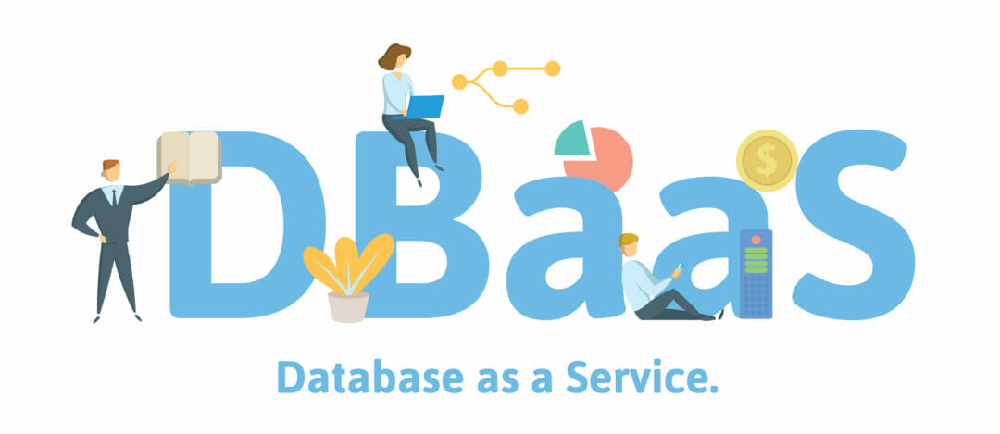

به مجموعه‌ای از داده‌های مرتبط که به صورت منسجم در کنار هم قرار می‌گیرند، دیتابیس گفته می‌شود. برای ذخیره‌سازی و مدیریت اطلاعات از دیتابیس استفاده می‌شود.

<!--truncate-->

## دیتابیس چیست؟
به مجموعه‌ای از داده‌های مرتبط که به صورت منسجم در کنار هم قرار می‌گیرند، دیتابیس گفته می‌شود. برای ذخیره‌سازی و مدیریت اطلاعات از دیتابیس استفاده می‌شود.
## DBaaS چیست؟ 
مفهوم Database as a Service) DBaaS) به عنوان یک خدمت محاسبات ابر (cloud computing)شکل گرفت، که دسترسی به یک پایگاه داده را بدون نیاز به راه‌اندازی سخت‌افزار فیزیکی و نصب نرم‌افزار یا پیکربندی پایگاه داده فراهم می‌کند.

 اکثر سرویس دهنده‌های کلود این خدمت را با هدف ساده‌سازی مدیریت پایگاه داده، کاهش هزینه مشتریان، کاهش دغدغه نگهداری و همچنین بهبود انعطاف‌پذیری ارائه می‌دهند.

بازار DBaaS و پایگاه‌های داده ابری یکی از بازارهای نرم‌افزار به‌عنوان سرویس (SaaS) است که سریع‌ترین رشد را دارد و انتظار می‌رود تا سال 2025 به 320 میلیارد دلار افزایش یابد. فروشندگان پایگاه داده و انبار داده در ارائه نسخه‌های میزبانی شده نرم‌افزار خود به ارائه دهندگان ابری ملحق شده‌اند و مشتریان را قادر می‌سازند تا از مزایای بسیاری از محاسبات ابری برای ذخیره‌سازی داده، جستجو و نیازهای دسترسی برنامه‌های خود استفاده کنند.

### انواع دیتابیس

#### 1. دیتابیس رابطه‌ای (Relational Database): 
این نوع دیتابیس بر اساس مدل روابط (Tables) ساخته می‌شود و از زبان SQL برای مدیریت داده‌ها استفاده می‌کند، از دیتابیس‌های رابطه‌ای می‌توان به MySQL، Oracle، SQL Server اشاره نمود. 
#### 2. دیتابیس NoSQL:
دیتابیس‌های NoSQL الگوهای مختلفی از داده‌ها را پشتیبانی می‌کنند، همچنین برای الگوهای کاربردی متفاوت مناسب‌اند. 
دیتابیس‌های MongoDB، Cassandra، Redis از جمله این دیتابیس‌ها هستند. 
#### 3. دیتابیس NewSQL: 
NewSQL یک دسته از پایگاه‌های داده‌های رابطه‌ای است که به طور خاص برای مقیاس‌پذیری و عملکرد بالا طراحی شده‌اند. این دسته از پایگاه‌های داده، تلاش می‌کنند تا ویژگی‌هایی که در پایگاه‌های داده NoSQL وجود دارند مثل مقیاس‌پذیری افزایشی و انعطاف‌پذیری را با ویژگی‌هایی که در پایگاه‌های داده رابطه‌ای قدیمی موجود است، درکنارهم قرار گیرند. مانند قابلیت (ACID (Atomicity، Consistency، Isolation، Durability و پشتیبانی از SQL، ترکیب کنند. به عبارت دیگر، NewSQL سعی دارد تا کارایی و مقیاس‌پذیری را به همراه قابلیت‌هایی مانند تضمین انطباق و تراکنش‌های پایدار، به پایگاه‌های داده رابطه‌ای بیافزاید.
دیتابیس‌های MemSQL،NuoDB،ClustrixDBاز جمله این دیتابیس‌ها هستند. 

## دلایل به وجود آمدن DBaaS 

فلسفه خلق DBaaS، جهت پاسخگویی به نیاز مشتریان است، از جمله دلایل می‌توان به موارد زیر اشاره کرد: 
فراهم‌سازی منابع بر اساس مقدار تقاضا: 

DBaaS می‌تواند بر اساس میزان تقاضا مشتری دسترسی به منابع محاسباتی را فراهم می‌کنند، همچنین به کسب‌وکارها امکان مقیاس‌پذیرتر شدن حجم کارها را ایجاد می‌کند. این روند انعطاف‌پذیری عملکرد و همچنین استفاده از منابع را بهینه می‌کند. 

### دسترسی جهانی: 

راه‌حل‌های DBaaS مبتنی بر ابر دسترسی گسترده‌ای را فراهم می‌کنند، که به تیم‌های توزیع‌شده، اجازه می‌دهد که همکاری بدون مشکل داشته باشند. این مزیت بخصوص برای کسب‌وکارهایی با نیروی کار گسترده جغرافیایی (در شهرها و یا کشورهای دیگر) مورد استفاده قرار می‌گیرد. 

### نوآوری مداوم: 

ارائه دهندگان سرویس‌های ابری به‌طور مداوم سعی در بروزرسانی خدمات خود دارند. و در تلاشند ویژگی‌ها و قابلیت‌های جدید را معرفی و ارائه دهند. کاربران DBaaS
 می‌توانند از این نوآوری‌ها بدون نیاز به ارتقاء دستی یا اختلالات قابل توجه در پایگاه داده خود بهره‌مند شوند.
 
### کاربردهای DBaaS در کسب وکارها

#### 1. توسعه و تست نرم‌افزار: 
توسعه‌دهندگان می‌توانند از DBaaS برای ایجاد و تست دیتابیس‌های خود قبل از انتقال به محیط اصلی محصول استفاده کنند. همچنین امکان توسعه و تست نرم‌افزار خود را با سرعت بالا و با کمترین هزینه برای توسعه دهندگان فراهم نموده. 
#### 2. راه‌اندازی وب‌سایت‌ها و برنامه‌ها: 
شرکت‌ها و توسعه‌دهندگان می‌توانند از DBaaS برای ذخیره‌سازی و مدیریت داده‌های برنامه‌ها و وب‌سایت‌های خود استفاده کنند. این روش به آن‌ها اجازه می‌دهد که بدون نگرانی از مسائل مدیریتی به توسعه و مدیریت دیتابیس‌های خود بپردازند. 
#### 3. اطلاعات مشتری و تحلیل داده: 
همچنین می‌توان از DBaaS برای ذخیره و تحلیل داده‌های مشتریان و اطلاعات تجاری خود استفاده کنند. این روش به سرعت و با بهره‌وری بیشتر از داده‌های خود و همینطور تحلیل‌های مفیدی مورد استفاده قرار می‌گیرد. 
#### 4. پشتیبان‌گیری و بازیابی: 
شرکت‌ها می‌توانند از DBaaS برای پشتیبان‌گیری و بازیابی داده‌های خود استفاده کنند. این روش به آن‌ها کمک می‌کند که بدون نگرانی از مسائل مانند پشتیبان‌گیری و امنیت داده‌های خود را مدیریت کنند.

### مزایای DBaaS:
از مزایای استفاده شرکت‌ها از DBaaS می‌توان به صرفه جویی در زمان و هزینه اشاره کرد، در عین حال وظایف پیچیده مدیریت اطلاعات را ساده کند. 

  از رایج‌ترین مزایای DBaaS که در سازمان‌ها مورد استفاده قرار می‌گیرد، می‌توان به:

#### 1.صرفه جویی در هزینه ها

 ایجاد زیرساخت برای مدیریت پایگاه داده گران است. بزرگ کردن مقیاس آن در صورت نیاز پرهزینه و اغلب بیهوده است. با DBaaS، سازمان شما هزینه‌های دوره‌ای قابل پیش‌بینی را بر اساس منابعی که مصرف می‌کنید پرداخت می‌کند و نیازی به خرید ظرفیت اضافی برای داشتن نیازهای فرضی آینده نیست.
#### 2.مقیاس‌پذیری بالا و پایین: 
در صورت نیاز می‌توانید به سرعت و به راحتی ظرفیت ذخیره‌سازی و محاسباتی اضافی را در زمان اجرا فراهم کنید، و می‌توانید کلاستر پایگاه داده خود را در زمان‌های غیر اوج استفاده کاهش دهید تا در هزینه صرفه‌جویی کنید.
##### 3.مدیریت ساده‌تر و کم هزینه‌تر:
 برای مدیریت و نگهداری پایگاه داده در محل، به یک تیم اداری داخلی نیاز دارید. با DBaaS، ارائه‌دهنده ابر همه چیز را مدیریت می‌کند (اگرچه در صورت تمایل می‌توانید جنبه‌های خاصی را خودتان مدیریت کنید). DBaaS بار اداری را بر روی کارکنان فناوری اطلاعات فعلی شما کم می‌کند و آنها را آزاد می‌کند تا روی برنامه‌ها و نوآوری کار کنند.
#### 4.توسعه سریع و ورود سریع‌تر به بازار: 
با یک سیستم پایگاه داده در محل، تیم‌های توسعه معمولاً نیاز به درخواست دسترسی از طریق فناوری اطلاعات دارند، فرآیندی که ممکن است روزها یا هفته‌ها طول بکشد. در مقابل، با DBaaS، توسعه‌دهندگان می‌توانند به خود در قابلیت‌های پایگاه داده کمک کنند و پایگاه‌داده‌ای را بچرخانند و پیکربندی کنند که در عرض چند دقیقه با برنامه‌شان ادغام شود.
#### 5.امنیت داده‌ها و برنامه‌ها: 
ارائه‌دهندگان پایگاه داده ابری معمولاً امنیت درجه سازمانی را ارائه می‌کنند، از جمله ویژگی‌هایی مانند رمزگذاری پیش‌فرض داده‌ها در حالت استراحت و در حین انتقال و کنترل‌های مدیریت هویت و دسترسی یکپارچه. برخی نیز استانداردهای انطباق مقرراتی خاص را دارند.
#### 6.کاهش ریسک: 
پیشنهادات DBaaS از ارائه‌دهندگان اصلی ابر معمولاً شامل یک توافق‌نامه سطح سرویس (SLA) است که مقدار مشخصی از زمان کار را تضمین می‌کند. در صورتی که ارائه‌دهنده شما الزامات مندرج در SLA را برآورده نکند، هر گونه خرابی اضافی را که تجربه می‌کنید جبران می‌شود.
#### 7.کیفیت نرم‌افزار:
 ارائه‌دهندگان اصلی ابر طیف گسترده‌ای از گزینه‌های DBaaS با قابلیت پیکربندی بالا را ارائه می‌دهند که هر کدام از کیفیت بالایی برخوردار هستند، بنابراین شما نگران عبور از صدها پایگاه داده مختلف نخواهید بود.

 ### چه کسانی می‌توانند از DBaaS استفاده کنند؟ 

#### 1. پلتفرم‌های تجارت الکترونیکی کوچک تا بزرگ

فروشگاه‌های اینترنتی کوچک و بزرگ از DBaaS برای مدیریت دیتابیس‌های خود استفاده می‌کنند. این سرویس به فروشگاه‌ها قابلیت این موضوع را که بدون نگرانی از نگهداری و مدیریت زیرساخت دیتابیس، به مدیریت داده‌های خود بپردازند. 

#### 2. خدمات پشتیبان اپلیکیشن موبایل

شرکت‌های توسعه دهنده نرم‌افزارهای موبایل از DBaaS برای ارائه خدمات پشتیبانی به اپلیکیشن‌های موبایل خود استفاده می‌کنند. DBaaS به این شرکت‌ها امکان می‌دهد که به سرعت و با مقیاس‌پذیری بالا دیتابیس‌های مورد نیاز اپلیکیشن‌های خود را ایجاد و مدیریت کنند. 

#### 3. خدمات مالی 

صنعت خدمات مالی از DBaaS برای ذخیره و مدیریت داده‌های مالی و مشتریان خود استفاده می‌کند. DBaaS به این صنعت امکان می‌دهد که با رعایت مقررات امنیتی و بهره‌وری بالا، داده‌های مالی و مشتریان را مدیریت کند.
