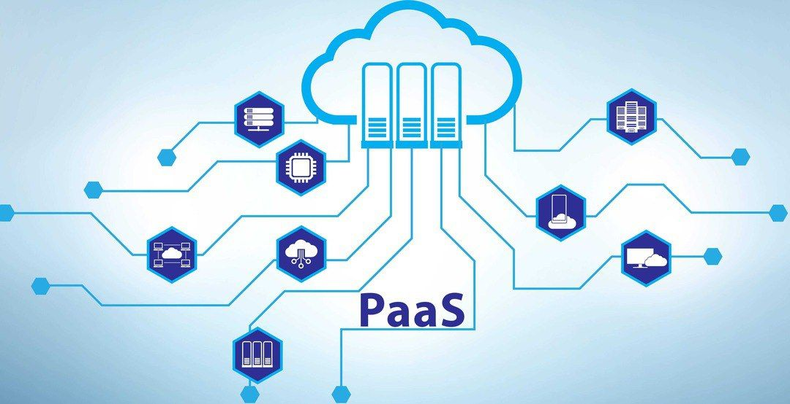

پلتفرم به عنوان یک سرویس (PaaS) یک محیط توسعه و استقرار کامل در فضای ابری است، با منابعی که به شما امکان می‌دهد همه چیز را از برنامه‌های ساده مبتنی بر ابر تا برنامه‌های کاربردی سازمانی پیچیده را بر بستر ابری ارائه دهید.

<!--truncate-->

### پلتفرم به عنوان یک سرویس (PaaS):
پلتفرم به عنوان یک سرویس (PaaS) یک محیط توسعه و استقرار کامل در فضای ابری است، با منابعی که به شما امکان می‌دهد همه چیز را از برنامه‌های ساده مبتنی بر ابر تا برنامه‌های کاربردی سازمانی پیچیده را بر بستر ابری ارائه دهید. شما منابع مورد نیاز خود را از یک ارائه دهنده خدمات ابری به صورت پرداختی خریداری می‌کنید و از طریق یک اتصال اینترنتی ایمن به آن‌ها دسترسی دارید.

### PaaS چگونه عمل می‌کند؟
PaaS با ارائه تمام ابزار‌های توسعه استاندارد از طریق رابط کاربری گرافیکی (GUI) رابط آنلاین عمل می‌کند. در واقع توسعه‌دهندگان می‌توانند برای همکاری در پروژه‌ها، تست برنامه‌های جدید یا عرضه محصولات تکمیل‌شده از هر جایی به سیستم وارد شوند. ارائه‌دهندگان PaaS مدیریت خدمات رایانش ابری شما مانند سرور‌ها، زمان اجرا و مجازی‌سازی را بر عهده می‌گیرند.

### مزایایPaaS
 از جمله مزایای PaaS میتوان به:

#### زمان کوتاه تر برای بازاریابی:
با PaaS، نیازی به تهیه و نصب سخت‌افزار و نرم‌افزاری برای ساخت و نگهداری پلتفرم توسعه برنامه ندارید.

#### کاهش زمان کدنویسی:
پلتفرم (PaaS) ابزارهای توسعه، ویژگی‌های امنیتی، سرویس‌های مربوط به دایرکتوری، و اپلیکشن های آماده را در اختیار کاربران قرار می‌دهد. این ویژگی‌ موجب میشود که توسعه دهندگان، بصورت جداگانه به هر بخش دسترسی داشته باشند.و در هرجایی قادر به انجام امورات خود شوند.
از آنجایی که محیط توسعه از طریق اینترنت قابل دسترسی است، تیم‌های توسعه می‌توانند حتی زمانی که اعضای تیم در مکان‌های دوردست هستند، روی پروژه‌ها با هم کار کنند.

#### مقیاس‌پذیری آسان و مقرون به صرفه:
درPaaS محاسبات مالی بصورت(Pay-As-You-Go)می‌باشد، به این صورت که بازای مقدار مصرفی از منابع محاسباتی در جهت توسعه و تحلیل اپلیکیشن ها هزینه کسر خواهد شد.

#### مدیریت اثر بخش در چرخه حیات اپلیکیشن:
سرویس PaaS با ارائه ابزار هاو خدمات خود موجب اثربخشی در چرخه حیات اپلیکیشن ها می‌گردد. این امر موجب سهولت هرچه بیشتر، مدیریت اپلیکیشن‌ها  در سازمان‌ها می‌شود.
