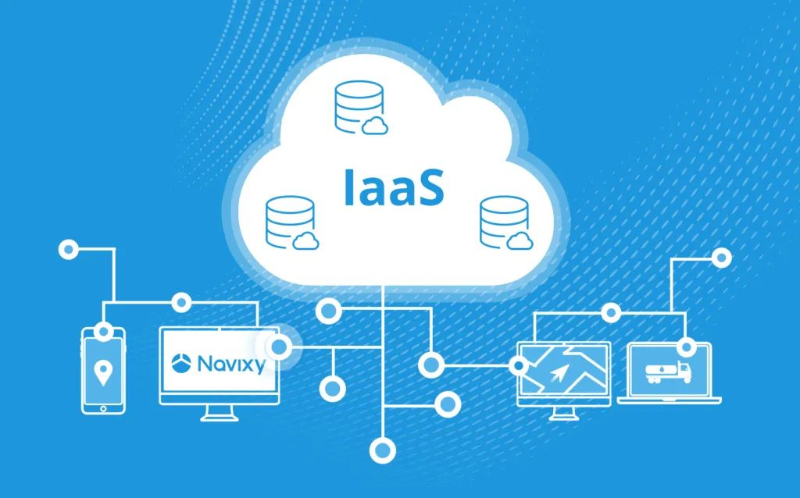

زیرساخت به عنوان سرویس "IaaS)Infrastructure as a Service)" که برای اجرای برنامه‌ها و نرم‌افزارها از طریق اینترنت می‌باشد. با استفاده از IaaS، می‌توانید منابع مانند سرورها، شبکه‌ها، ذخیره‌سازی و ماشین‌های مجازی را به صورت مجازی در اختیار داشته باشید.

<!--truncate-->

### مزایای استفاده از IaaS

#### 1.افزایش انعطاف‌پذیری و مقیاس‌پذیری
یکی از مزایای برجسته استفاده از IaaS، امکان افزایش انعطاف‌پذیری و مقیاس‌پذیری سیستم‌ها است. با استفاده از این سرویس، می‌توانید به راحتی منابع مورد نیاز خود را بر اساس نیازهای فعلی تغییر داده و سیستم خود را متناسب با بار کار ارتقا دهید.
#### 2.کاهش هزینه‌های سرمایه‌ای
شما می‌توانید بدون نیاز به خرید سخت‌افزار و نرم‌افزارهای پیشرفته، از منابع مورد نیاز برای اجرای برنامه‌ها استفاده کنید. این امر موجب کاهش هزینه‌های سرمایه‌ای و افزایش بهره‌وری می‌شود.
#### 3.حفظ امنیت و پایداری داده‌ها
با استفاده از IaaS، شما به راحتی می‌توانید داده‌های خود را در محیطی امن و پایدار نگهداری کنید. امکانات امنیتی متنوعی که توسط ارائه‌دهندگان IaaS ارائه می‌شود، از جمله مانیتورینگ 24/7(شبانه روزی) و پشتیبانی فنی حرفه‌ای، اطمینان از حفظ امنیت داده‌های شما را فراهم می‌کند.

### انواع سرویس IaaS
سرویس‌های ابری IaaS به دو صورت اصلی ارائه می‌شوند: عمومی و خصوصی. در زیر به توضیح هر یک اشاره می‌کنیم:
#### IaaS عمومی (Public IaaS):
این نوع از خدمات ابری توسط سرویس دهندگان عمومی ارائه می‌شود و برای استفاده عمومی قابل دسترسی است.
در این حالت، منابع ابری اشتراکی هستند و سازمان‌های مختلف می‌توانند از این منابع برای اجرای برنامه‌ها و سرویس‌ها خود استفاده کنند.
#### IaaS خصوصی (Private IaaS):
این نوع از خدمات ابری به شرکت یا سازمان خاصی ارائه می‌شود و برای استفاده داخلی یا محدود کاربران خاص است.
در این حالت، منابع ابری به صورت خصوصی برای یک شرکت، سازمان یا سازمان‌های مشارکتی اختصاص می‌یابد.
از مزایای IaaS خصوصی می‌توان به کنترل بیشتر بر امنیت و حریم خصوصی اشاره کرد.
سازمان‌ها معمولاً از این روش برای مدیریت و کنترل منابع ابری خود و اطلاعات مهم استفاده می‌کنند.

### کاربرد سرویس ابری IaaS
سرویس ابری IaaS برای انواع کاربردها و صنایع مختلف مورد استفاده قرار می‌گیرد. تعدادی از کاربردهای اصلی سرویس ابری IaaS عبارتند از:
#### میزبانی وب و اپلیکیشن‌ها: 
شرکت‌ها و سازمان‌ها می‌توانند سرویس‌های وب و اپلیکیشن‌های خود را بر روی زیرساخت ابری IaaS میزبانی کرده و به راحتی مقیاس‌پذیری و انعطاف‌پذیری بخش زیرساخت خود را مدیریت کنند.
#### توسعه و تست نرم‌افزار: 
توسعه‌دهندگان می‌توانند بدون نیاز به هزینه‌های سرورها و تجهیزات فیزیکی، از زیرساخت ابری IaaS برای توسعه، تست و اجرای نرم‌افزارهای خود استفاده کنند.
#### پشتیبان‌گیری و مدیریت داده:
 سرویس‌های IaaS برای ذخیره سازی و مدیریت اطلاعات و پشتیبان‌گیری داده‌ها استفاده می‌شوند، که امکان دسترسی به اطلاعات در هر زمان و از هر کجا را فراهم می‌کنند.
این تنها تعداد محدودی از کاربردهای سرویس ابری IaaS هستند و این سرویس برای صنایع مختلفی اهمیت دارد، چون به شرکت‌ها امکان می‌دهد تا منابع مورد نیاز خود را با هزینه‌های کمتر، بهبود یافته و مدیریت کنند.

### محدودیت‌ها و چالش‌های IaaS 
استفاده از IaaS همراه با محدودیت‌ها و چالش‌هایی نیز همراه است که باید به آن‌ها توجه کنید. برخی از این محدودیت‌ها شامل محدودیت‌های قوانین و مقررات محلی، و تنظیمات پیچیده مدیریتی می‌باشند.

