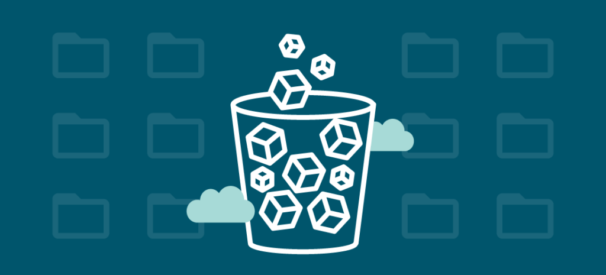

Object Storage یا ذخیره‌سازی اشیا، یک مدل ذخیره‌سازی داده‌ها است که اطلاعات را به صورت اشیا (Objects) ذخیره می‌کند. هر شیء شامل داده‌ها و فراداده‌های مرتبط با آن است که به صورت یک واحد مستقل ذخیره می‌شوند.

<!--truncate-->

## Object Storage چیست؟
### تعریف و مفهوم کلی
Object Storage یا ذخیره‌سازی اشیا، یک مدل ذخیره‌سازی داده‌ها است که اطلاعات را به صورت اشیا (Objects) ذخیره می‌کند. هر شیء شامل داده‌ها و فراداده‌های مرتبط با آن است که به صورت یک واحد مستقل ذخیره می‌شوند.

### تفاوت آبجکت استورج با ذخیره‌سازی سنتی
برخلاف ذخیره‌سازی سنتی که داده‌ها را به صورت فایل‌ها و بلوک‌ها ذخیره می‌کند، Object Storage داده‌ها را به صورت اشیا مدیریت می‌کند. این شیوه ذخیره‌سازی به دلیل مقیاس‌پذیری و انعطاف‌پذیری بالا، به خصوص برای داده‌های بزرگ و پراکنده بسیار مناسب است.
### مزایای استفاده از Object Storage
#### ۱. مقیاس‌پذیری بالا

یکی از بزرگ‌ترین مزایای Object Storage، مقیاس‌پذیری بالای آن است. شما می‌توانید به راحتی و بدون نیاز به تغییرات بزرگ در ساختار، حجم زیادی از داده‌ها را ذخیره و مدیریت کنید.
#### ۲. کارایی و سرعت دسترسی

Object Storage به دلیل ساختار غیرمتمرکز و استفاده از پروتکل‌های مدرن، سرعت بالایی در دسترسی به داده‌ها دارد. این ویژگی به ویژه برای برنامه‌ها و سرویس‌هایی که نیاز به دسترسی سریع به داده‌ها دارند بسیار مهم است.
#### ۳. کاهش هزینه‌ها

با استفاده از Object Storage، هزینه‌های مرتبط با ذخیره‌سازی داده‌ها به شدت کاهش می‌یابد. همچنین می‌توان به جای خرید سخت‌افزارهای گران‌قیمت، از سرویس‌های ابری با هزینه کمتر استفاده کنید.
### کاربردهای Object Storage

#### ذخیره‌سازی داده‌های بزرگ
یکی از مهم‌ترین کاربردهای Object Storage، ذخیره‌سازی داده‌های بزرگ مانند داده‌های علمی، ویدئوها و تصاویر با کیفیت بالا است.

#### پشتیبان‌گیری و بازیابی
Object Storage به عنوان یک راهکار موثر برای پشتیبان‌گیری و بازیابی داده‌ها نیز شناخته می‌شود. همچنین می‌تون به راحتی و با اطمینان از این فناوری برای پشتیبان‌گیری از داده‌های مهم استفاده کنید.

#### ذخیره‌سازی محتوا
سرویس‌های محتوا مانند وب‌سایت‌ها و برنامه‌های موبایل می‌توانند از Object Storage برای ذخیره‌سازی و ارائه محتوای خود استفاده کنند. این کار باعث افزایش کارایی و سرعت بارگذاری محتوا می‌شود.

### انواع Object Storage
#### Object Storage مبتنی بر فایل
این نوع Object Storage داده‌ها را به صورت فایل ذخیره می‌کند و برای کاربردهایی که نیاز به دسترسی سریع به فایل‌ها دارند مناسب است.
در این روش، داده‌ها به همراه فراداده‌هایی مانند زمان ایجاد، آخرین به‌روزرسانی، نام فایل و نوع فایل برچسب‌گذاری می‌شوند و در پوشه‌ها و دایرکتوری‌های مبتنی بر سلسله‌مراتب خاصی ذخیره می‌شوند. این روش به‌طور مشابهی مانند ذخیره و نگهداری اسناد در بایگانی‌های یک سازمان عمل می‌کند.

برای مثال، زمانی که یک سند کاغذی قرار است در بایگانی سازمانی ذخیره شود، ابتدا قفسه مورد نظر، سپس کشوی مربوط به موضوع آن پیدا می‌شود و سند در آنجا قرار می‌گیرد. همچنین برای دسترسی به اسناد باید همین مسیر را طی کرد. ایرادی که به File Storage وارد است، پیچیدگی و زمان‌بر بودن فرآیند جستجو در هنگام افزایش حجم اطلاعات است.

#### Object Storage مبتنی بر بلوک
در این نوع، داده‌ها به صورت بلوک‌های جداگانه ذخیره می‌شوند و بیشتر برای سیستم‌های ذخیره‌سازی سنتی کاربرد دارد.
ذخیره‌سازی بلوکی روشی بهینه‌تر نسبت به ذخیره‌سازی فایل است. در این روش، یک فایل به بلوک‌های هم‌اندازه تقسیم می‌شود و هر بلوک با یک آدرس جداگانه ذخیره می‌گردد. این شیوه باعث بهبود عملکرد و افزایش سرعت دسترسی به داده‌ها می‌شود و نیازی به ساخت پوشه‌ها و سلسله‌مراتب همراه با دایرکتوری‌ها برای دسترسی به داده‌ها نیست.

برای استفاده از یک فایل، سیستم‌عامل آدرس‌های هر بلوک را فراخوانی می‌کند و با جمع آوری آن‌ها، فایل اصلی را می‌سازد. این نوع معماری از نگهداری و مدیریت فایل‌ها، به دلیل سرعت بالا و تأخیر کم، در برخی برنامه‌های تجاری، پایگاه‌داده‌ها، ماشین‌های مجازی و در کل مواردی که نیاز به پردازش سریع دارند، بسیار کاربردی است.

### چگونه یک Object Storage انتخاب کنیم؟

#### نیازها و الزامات کسب‌وکار
اولین قدم در انتخاب یک Object Storage مناسب، بررسی نیازها و الزامات کسب‌وکار است. باید مشخص شود که چه حجم داده‌ای نیاز به ذخیره‌سازی دارد و چه سطحی از امنیت و دسترسی لازم است.
#### امنیت و قابلیت اطمینان
امنیت داده‌ها یکی از مهم‌ترین فاکتورها در انتخاب Object Storage است. باید اطمینان حاصل کنید که سرویس انتخابی شما دارای استانداردهای بالای امنیتی و قابلیت اطمینان باشد.
### معماری و ساختار Object Storage

#### اجزای اصلی
معماری یک Object Storage شامل اجزای مختلفی مانند سرورها، شبکه‌ها و نرم‌افزارهای مدیریت داده است. 
#### نحوه مدیریت داده‌ها
داده‌ها در Object Storage به صورت اشیا ذخیره می‌شوند و هر شیء شامل داده‌ها و فراداده‌های مرتبط با آن است. مدیریت این اشیا از طریق پروتکل‌های مدرن و نرم‌افزارهای مدیریت داده انجام می‌شود.

### مقایسه Object Storage با دیگر روش‌های ذخیره‌سازی

#### مقایسه با ذخیره‌سازی بلوکی(Block storage)
ذخیره‌سازی بلوکی داده‌ها را به صورت بلوک‌های کوچک ذخیره می‌کند و برای کاربردهایی که نیاز به دسترسی سریع و دقیق به داده‌ها دارند مناسب است. در مقابل، Object Storage برای ذخیره‌سازی داده‌های بزرگ و پراکنده مناسب‌تر است.
#### مقایسه با ذخیره‌سازی فایل(File storage)
ذخیره‌سازی فایل داده‌ها را به صورت فایل‌های جداگانه ذخیره می‌کند و برای کاربردهایی که نیاز به سازماندهی دقیق فایل‌ها دارند مناسب است. Object Storage اما به دلیل مقیاس‌پذیری و انعطاف‌پذیری بالاتر، برای ذخیره‌سازی داده‌های بزرگ بهتر عمل می‌کند.
### چالش‌ها و مشکلات استفاده از Object Storage

- امنیت داده‌ها
یکی از چالش‌های اصلی در استفاده از Object Storage، اطمینان از امنیت داده‌ها است. داده‌های ذخیره‌شده باید به خوبی محافظت شوند تا از دسترسی غیرمجاز و حملات سایبری جلوگیری شود. برای این منظور، استفاده از پروتکل‌های امنیتی و رمزنگاری داده‌ها ضروری است.
- مدیریت هزینه‌ها
اگرچه Object Storage معمولاً هزینه‌های کمتری نسبت به روش‌های سنتی دارد، اما مدیریت هزینه‌ها همچنان یک چالش است. باید به دقت هزینه‌های مرتبط با ذخیره‌سازی، انتقال و دسترسی به داده‌ها را کنترل کنید تا از افزایش ناخواسته هزینه‌ها جلوگیری شود.
- پیچیدگی مدیریت
مدیریت یک Object Storage به دلیل تعداد زیاد اشیا و حجم بزرگ داده‌ها می‌تواند پیچیده باشد. باید از ابزارها و نرم‌افزارهای مدیریتی مناسب استفاده کنید تا بتوانید به طور کارآمد داده‌ها را سازماندهی و دسترسی داشته باشید.
