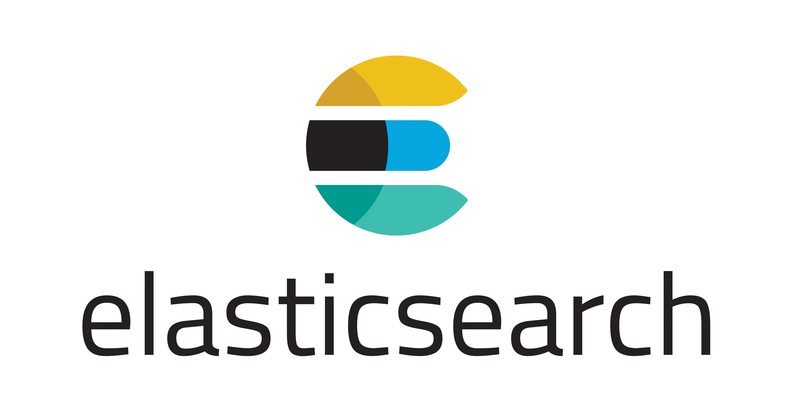

الستیک سرچ (Elastic Search) یک موتور جستجو و تجزیه و تحلیل توزیع‌شده و متن‌باز است که می‌تواند برای موارد مختلفی مانند ثبت گزارش، مانیتورینگ، امنیت و موارد دیگر کاربرد داشته باشد.

<!--truncate-->
## الستیک سرچ (Elastic Search) چیست؟

الستیک سرچ یک موتور جستجو و تجزیه و تحلیل توزیع‌شده و متن‌باز است که می‌تواند برای موارد مختلفی مانند ثبت گزارش، مانیتورینگ، امنیت و موارد دیگر کاربرد داشته باشد. این موتور امکان اجرا در فضای ابری را نیز دارد و به شما این امکان را می‌دهد تا حجم عظیمی از داده‌ها را تقریباً به صورت آنی ذخیره، جستجو و تحلیل کنید. الاستیک سرچ به گونه‌ای طراحی شده تا کاملاً مقیاس‌پذیر، انعطاف‌پذیر و مقاوم باشد و می‌تواند از داده‌های ساختاریافته (Structured)، غیرساختاریافته (Unstructured)، مکانی، متریک و متنی پشتیبانی کند.
### نحوه کار الستیک سرچ
### ایجاد ایندکس
برای جستجوی سریع و کارآمد در داده‌های متنی، الستیک سرچ داده‌ها را به یک ساختار خاص تبدیل می‌کند که به آن "ایندکس" گفته می‌شود. این ایندکس شامل توکن‌ها، کلمات کلیدی و اطلاعاتی درباره موقعیت کلمات در متن است.

#### 1.تجزیه و تحلیل متن
قبل از ایجاد ایندکس، الستیک سرچ داده‌های متنی را تجزیه و تحلیل کرده و متن را به کلمات و توکن‌ها تقسیم می‌کند.
#### 2.به‌روزرسانی ایندکس
بعد از تجزیه و تحلیل، الستیک سرچ ایندکس‌ها را ایجاد یا به‌روزرسانی می‌کند و اطلاعات مربوط به توکن‌ها و موقعیت آنها در متن را در ایندکس ذخیره می‌کند.
#### 3.جستجو و بازیابی داده
وقتی یک جستجوی متنی انجام می‌شود، الستیک سرچ از ایندکس‌های ایجاد شده استفاده می‌کند تا نتایج را بر اساس متن جستجو شده پیدا کند و از الگوریتم‌های جستجو و تطابق استفاده می‌شود.
#### 4.ترتیب و ارزیابی نتایج
نتایج جستجو در الستیک سرچ به ترتیبی که با استفاده از الگوریتم‌های ارزیابی مشخص می‌شود، نمایش داده می‌شوند.
#### 5.بازیابی و نمایش اطلاعات
پس از انجام مراحل جستجو و ارزیابی، نتایج جستجو به کاربران نمایش داده می‌شود که شامل متن‌های اصلی، پیش‌نمایش‌ها، موقعیت‌های کلمات کلیدی در متن و... می‌شود.
### مزایای استفاده از Elasticsearch
#### عملکرد بالا:
 الستیک می‌تواند حجم بالایی از داده‌ها را با سرعت بالا جستجو و تجزیه و تحلیل کند.
 #### مقیاس‌پذیری:
 به صورت افقی مقیاس‌بندی شده و نیازهای رو به رشد شما را برآورده می‌کند.
 #### قابلیت انعطاف‌پذیری:
 برای طیف گسترده‌ای از موارد استفاده، از جمله جستجوی متن، تجزیه و تحلیل لاگ و تجزیه و تحلیل داده‌ها قابل استفاده است.
 ### کاربردهای Elasticsearch
کاربردهای Elasticsearch هر روز در حال اضافه شدن و تغییر است، اما 5 مورد از اصلی‌ترین کاربردهای آن عبارتند از:
 #### تحلیل لاگ:
 الستیک سرچ همراه با ابزارهایی مانند Beats و Logstash، به یکی از آسان‌ترین روش‌های تحلیل لاگ تبدیل شده است. این ابزارها امکان جمع‌آوری داده‌ها از هر قسمت و ایندکس‌گذاری آنها را فراهم می‌کنند. 
 Kibana نیز به شما امکان ساخت داشبوردهای قدرتمند و تجزیه و تحلیل داده‌ها را می‌دهد.
 #### جمع‌آوری و ترکیب داده‌های عمومی:
 الستیک سرچ ابزارهای مختلفی برای جمع‌آوری و ایندکس‌گذاری ساده داده‌ها دارد و به علت نداشتن تم پیچیده و سخت‌گیرانه، انعطاف لازم برای بارگذاری و نگهداری منابع مختلف داده را فراهم می‌کند.
 #### جستجوی Full Text:
 یکی از مهم‌ترین قابلیت‌های Elasticsearch است. کاربران با استفاده از این قابلیت نتایج بهتری نسبت به جستجوهای قدیمی دریافت می‌کنند. Elasticsearch همچنین کوئری DSL مخصوص به خود را دارد.
 #### معیارها و داده‌های برنامه:
 در داده‌های سری زمانی مثل رویدادهای برنامه و معیارها، Elasticsearch قوی عمل می‌کند. 
سرویس Beats جمع‌آوری آسان داده‌ها را فراهم می‌کند و الاستیک سرچ امکان اضافه کردن هر کامپوننتی را که نیاز دارید فراهم می‌کند.
#### داده‌های تصویری:
 Kibana ابزار قدرتمندی برای تصویرسازی داده‌ها است که شامل امکانات ترسیم چارت، TimeLion برای داده‌های سری زمانی و سرویس tile برای اطلاعات جغرافیایی می‌شود.

### معایب Elasticsearch
**پیچیدگی**: Elasticsearch می‌تواند برای کاربران جدید کمی پیچیده باشد.

**نیاز به دانش فنی**: برای پیکربندی و مدیریت Elasticsearch به دانش فنی نیاز دارید.

### ELK چیست و مخفف چه کلماتی است؟
ELK اختصاری از سه مفهوم کلیدی در دنیای تحلیل و مانیتورینگ داده‌ها است که به شرکت ElasticStack اشاره دارد. این سیستم شامل سه عنصر Elasticsearch، Logstash و Kibana می‌شود که به یکدیگر متصل شده‌اند و به طور معمول برای مدیریت لاگ‌ها، مانیتورینگ عملکرد سیستم‌ها و برنامه‌ها، و تحلیل داده‌های مختلف در سطح سازمانی استفاده می‌شود. این ابزارها به شما کمک می‌کنند تا داده‌های خود را به طور مؤثر تحلیل و نظارت کنید.
### اجزای ELK
#### Elasticsearch:
 موتور جستجو و تحلیل متن‌باز برای جستجو و استخراج اطلاعات از داده‌های متنی.
#### Logstash:
 ابزار متن‌باز برای جمع‌آوری، تبدیل و ارسال داده‌های لاگ و داده‌های ساختاری از منابع مختلف به سایر ابزارها.
#### Kibana: 
ابزار متن‌باز برای تجزیه و تحلیل و نمایش داده‌ها در مختصات‌ها، نمودارها، داشبوردها و گزارش‌ها.
