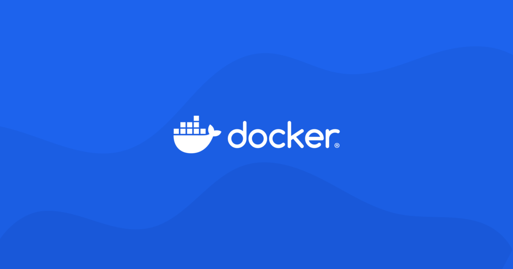

داکر (Docker) یکی از پیشروترین فناوری‌ها در زمینه مدیریت کانتینرها و استقرار نرم‌افزارهاست که به توسعه‌دهندگان و تیم‌های فناوری اطلاعات امکان می‌دهد تا برنامه‌ها و خدمات خود را با کارایی بالا، مقیاس‌پذیری و انعطاف‌پذیری بیشتری ایجاد، اجرا و مدیریت کنند. در این مقاله، به بررسی مفهوم داکر، مزایا، اجزا، موارد استفاده و نحوه شروع کار با این فناوری می‌پردازیم.

<!--truncate-->
### داکر(Docker) چیست؟
داکر یک پلتفرم متن‌باز است که برای ایجاد، استقرار و مدیریت کانتینرها استفاده می‌شود. کانتینرها به توسعه‌دهندگان اجازه می‌دهند تا برنامه‌های خود را با تمامی وابستگی‌ها و کتابخانه‌ها در یک محیط ایزوله اجرا کنند. این امر موجب می‌شود که برنامه‌ها به صورت قابل‌اعتماد و سازگار در محیط‌های مختلف اجرا شوند.

### مزایای داکر
- قابل‌حمل بودن (Portability):
 داکر به شما امکان می‌دهد تا برنامه‌های خود را در هر محیطی اجرا کنید، از لپ‌تاپ توسعه‌دهنده گرفته تا سرورهای تولید.
- مقیاس‌پذیری (Scalability):
 با داکر می‌توانید به سادگی کانتینرهای خود را مقیاس‌بندی کنید تا با نیازهای ترافیک و منابع متفاوت سازگار شوند.
- کارایی (Efficiency): 
داکر از منابع سیستم بهینه‌تر استفاده می‌کند و زمان لازم برای استقرار و اجرای برنامه‌ها را کاهش می‌دهد.
- ایزوله‌سازی (Isolation): 
هر کانتینر به صورت مستقل اجرا می‌شود و از بقیه کانتینرها جداست، که این امر امنیت و ثبات را افزایش می‌دهد.
- مدیریت ساده (Simplified Management):
 با استفاده از ابزارهای مدیریت کانتینر مانند Docker Compose و Kubernetes، مدیریت و هماهنگی کانتینرها ساده‌تر می‌شود.

### اجزای داکر
1. Docker Engine:
  این هسته اصلی داکر است که مسئول اجرای کانتینرها و مدیریت منابع آنها است.
2. Docker Daemon:
 این یک سرویس پس‌زمینه است که درخواست‌های API داکر را پردازش می‌کند و کانتینرها را مدیریت می‌کند.
3. Docker Client: این یک رابط خط فرمان (CLI) برای تعامل با داکر دیمون است. داکر کلاینت به کاربر امکان می‌دهد تا دستورات مختلف را جهت مدیریت کانتینرها و منابع داکر ارسال کند.
4. Docker Hub: این یک مخزن آنلاین است که برای ذخیره و اشتراک‌گذاری تصاویر کانتینرها استفاده می‌شود. کاربران می‌توانند تصاویر کانتینرهای خود را در Docker Hub بارگذاری کنند و با دیگران به اشتراک بگذارند.
5. Dockerfile: این یک فایل متنی است که شامل دستورالعمل‌هایی برای ساخت یک تصویر کانتینر است. این فایل شامل تمامی مراحل و دستورات مورد نیاز برای ساخت تصویر مورد نظر است.
6.  Docker run: این یک دستور است که موجب راه اندازی یک کانتینر می‌شود. با استفاده از این دستور، کاربر می‌تواند یک تصویر کانتینر را اجرا و از آن استفاده کند.

#### چرا از داکر باید استفاده کرد؟
- مدیریت منابع را آسان نموده است.
- فرآیند deploy یک سرویس یا اپلیکیشن را بهتر و آسانتر می‌کند.
- امکان scale up سرویس و اپلیکیشن به راحتی امکان پذیر می‌کند.
- کانتینرهایی که بر روی داکر استفاده می‌شوند جدا از سیستم‌عامل اصلی سیستم هستند. برای مثال شما می‌توانید بر روی سیستم‌عامل اوبونتو به کمک داکر، از image سیستم‌عامل cent os استفاده کنید.
- استفاده اشتراکی چندین داکر از یک منبع به راحتی امکان‌پذیر است.

### موارد استفاده از داکر
#### توسعه و تست نرم‌افزار: 
داکر به توسعه‌دهندگان امکان می‌دهد تا محیط‌های توسعه و تست یکسانی ایجاد کنند و از سازگاری برنامه‌ها در محیط‌های مختلف اطمینان حاصل کنند.
#### استقرار برنامه‌ها: 
با داکر می‌توانید برنامه‌های خود را به سرعت و با اطمینان در محیط‌های تولید مستقر کنید.
#### میکروسرویس‌ها: 
داکر به شما امکان می‌دهد تا برنامه‌های خود را به چندین سرویس کوچک و مستقل تقسیم کنید که هر کدام در یک کانتینر جداگانه اجرا می‌شوند.
#### پردازش داده‌ها:
 با استفاده از کانتینرهای داکر، می‌توانید فرآیندهای پردازش داده‌ها را به صورت موازی و با کارایی بالا اجرا کنید.
#### پلتفرم‌های ابری:
 داکر به شما امکان می‌دهد تا برنامه‌های خود را به سادگی در پلتفرم‌های ابری مختلف مانند AWS، Azure و Google Cloud مستقر کنید.
