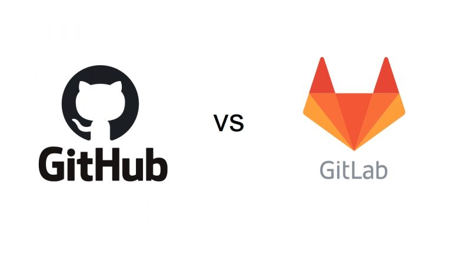

در دنیای امروز توسعه نرم‌افزار، ابزارهای مدیریت کد منبع و همکاری تیمی نقش بسیار مهمی ایفا می‌کنند. دو ابزار بسیار محبوب و پرکاربرد در این زمینه GitLab و GitHub هستند. این مقاله به معرفی کامل و جامع این دو ابزار، ویژگی‌ها، مزایا و کاربردهای آن‌ها می‌پردازد.

<!--truncate-->
## GitLab چیست؟
### معرفی GitLab
GitLab یک پلتفرم یکپارچه برای توسعه، تحویل و امنیت نرم‌افزار است که تمامی مراحل چرخه عمر توسعه نرم‌افزار را پشتیبانی می‌کند. این پلتفرم به توسعه‌دهندگان امکان می‌دهد که کدهای خود را مدیریت، تست کنند و بر روی آنها نظارت داشته باشند.
### تاریخچه GitLab
GitLab در سال 2011 توسط Dmitriy Zaporozhets و Valery Sizov بنیان‌گذاری شد. هدف اصلی این پلتفرم ایجاد یک ابزار یکپارچه برای مدیریت کد منبع و همکاری تیمی بود.
### ویژگی‌های GitLab
#### مدیریت کد منبع
GitLab امکان مدیریت کد منبع را با استفاده از سیستم گیت فراهم می‌کند. کاربران می‌توانند مخازن (ریپازیتوری‌ها) خود را ایجاد و مدیریت کنند.
CI/CD
یکی از ویژگی‌های برجسته GitLab، پشتیبانی از Continuous Integration و Continuous Deployment به اختصار CI/CD است. این ابزار به توسعه‌دهندگان کمک می‌کند تا به‌صورت خودکار کدهای خود را تست و مستقر سازند.
#### امنیت و اسکن کد
GitLab ابزارهای امنیتی پیشرفته‌ای مانند اسکن کد و تحلیل آسیب‌پذیری‌ها را فراهم می‌کند که به افزایش امنیت نرم‌افزار کمک می‌کند.
مزایای استفاده از GitLab
یکپارچگی بالا
GitLab تمامی ابزارهای مورد نیاز برای مدیریت چرخه عمر نرم‌افزار را در یک پلتفرم یکپارچه ارائه می‌دهد که این امر باعث افزایش بهره‌وری تیم‌های توسعه می‌شود.
امنیت بیشتر
با استفاده از ابزارهای امنیتی GitLab، تیم‌های توسعه می‌توانند به‌راحتی امنیت کدهای خود را افزایش دهند و از مشکلات امنیتی جلوگیری کنند.
## GitHub چیست؟
### معرفی GitHub

GitHub یک پلتفرم میزبانی کد منبع است که از سیستم گیت برای مدیریت کدها استفاده می‌کند. این پلتفرم به توسعه‌دهندگان امکان می‌دهد که کدهای خود را با دیگران به اشتراک بگذارند و به‌صورت تیمی روی پروژه‌ها کار کنند.
### تاریخچه GitHub

GitHub در سال 2008 توسط Tom Preston-Werner، Chris Wanstrath، PJ Hyett و Scott Chacon تأسیس شد. این پلتفرم به‌سرعت به یکی از محبوب‌ترین ابزارهای میزبانی کد تبدیل شد و در سال 2018 توسط مایکروسافت خریداری شد.
ویژگی‌های GitHub
مخازن عمومی و خصوصی
GitHub امکان ایجاد مخازن عمومی و خصوصی را فراهم می‌کند. مخازن عمومی به همه کاربران اجازه مشاهده و مشارکت در پروژه‌ها را می‌دهند، در حالی که مخازن خصوصی فقط برای کاربران خاص قابل دسترسی هستند.
### گیتهاب اکشن‌ها

GitHub Actions ابزارهایی برای خودکارسازی وظایف توسعه و استقرار نرم‌افزار هستند. این ابزارها به توسعه‌دهندگان کمک می‌کنند تا به‌صورت خودکار تست‌ها را اجرا و نرم‌افزارها را مستقر کنند.
### مزایای استفاده از GitHub
#### جامعه بزرگ و فعال

یکی از بزرگ‌ترین مزایای GitHub، جامعه بزرگ و فعال آن است. توسعه‌دهندگان از سراسر جهان در GitHub حضور دارند و می‌توانند به پروژه‌های مختلف کمک کنند.
پشتیبانی گسترده از ابزارها و سرویس‌ها
GitHub از ابزارها و سرویس‌های مختلفی مانند IDE‌ها، CI/CD سرویس‌ها و ابزارهای مدیریت پروژه پشتیبانی می‌کند که این امر به توسعه‌دهندگان کمک می‌کند تا به‌صورت یکپارچه‌تر و کارآمدتر کار کنند.
### مقایسه GitLab و GitHub
#### تفاوت‌ها و شباهت‌ها

هر دو پلتفرم GitLab و GitHub از سیستم گیت برای مدیریت کد منبع استفاده می‌کنند و ابزارهای مشابهی برای CI/CD و امنیت کد فراهم می‌کنند. با این حال، GitLab بیشتر بر یکپارچگی ابزارها تمرکز دارد، در حالی که GitHub به جامعه بزرگ و پشتیبانی از ابزارهای مختلف معروف است.
#### کدامیک بهتر است؟

انتخاب بین GitLab و GitHub بستگی به نیازها و ترجیحات شما دارد. اگر به دنبال یک پلتفرم یکپارچه با ابزارهای متعدد هستید، GitLab گزینه مناسبی است. اگر جامعه بزرگ و پشتیبانی از ابزارهای مختلف برای شما مهم‌تر است، GitHub بهترین انتخاب خواهد بود.
### کاربردهای GitLab و GitHub

استفاده در پروژه‌های متن باز
هر دو پلتفرم GitLab و GitHub برای پروژه‌های اوپن سورس بسیار مناسب هستند. توسعه‌دهندگان می‌توانند کدهای خود را با دیگران به اشتراک بگذارند و از کمک جامعه توسعه دهندگان بهره‌مند شوند.
استفاده در سازمان‌ها و شرکت‌ها
بسیاری از سازمان‌ها و شرکت‌ها از GitLab و GitHub برای مدیریت کد منبع و همکاری تیمی استفاده می‌کنند. این پلتفرم‌ها به تیم‌های توسعه کمک می‌کنند تا به‌صورت کارآمدتر و سازمان‌یافته‌تر کار کنند.
### ابزارهای مکمل GitLab

#### GitLab Runner
GitLab Runner یک ابزار است که برای اجرای کارهای CI/CD در GitLab استفاده می‌شود. این ابزار به توسعه‌دهندگان کمک می‌کند تا به‌صورت خودکار تست‌ها و استقرارها را انجام دهند.
#### GitLab Pages

GitLab Pages ابزاری است که به شما امکان می‌دهد وب‌سایت‌های استاتیک خود را میزبانی کنید. این ابزار برای مستندسازی و ارائه پروژه‌های اوپن سورس بسیار مفید است.
### ابزارهای مکمل GitHub
#### GitHub Pages

GitHub Pages نیز ابزاری مشابه GitLab Pages است که به شما امکان می‌دهد وب‌سایت‌های استاتیک خود را میزبانی کنید.
#### GitHub Packages

GitHub Packages ابزاری است که به شما امکان می‌دهد بسته‌های نرم‌افزاری خود را مدیریت و توزیع کنید. این ابزار از انواع مختلف بسته‌ها مانند NPM، Docker و Maven پشتیبانی می‌کند.
### نتیجه‌گیری

GitLab و GitHub هر دو ابزارهای قدرتمند و پرکاربردی برای مدیریت کد منبع و همکاری تیمی هستند. انتخاب بین این دو پلتفرم بستگی به نیازها و ترجیحات شما دارد. با توجه به ویژگی‌ها و مزایای هر کدام، می‌توانید بهترین گزینه را برای پروژه‌های خود انتخاب کنید.
